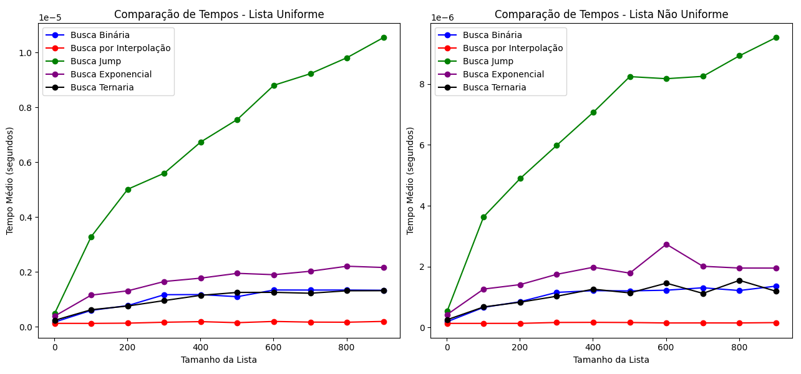
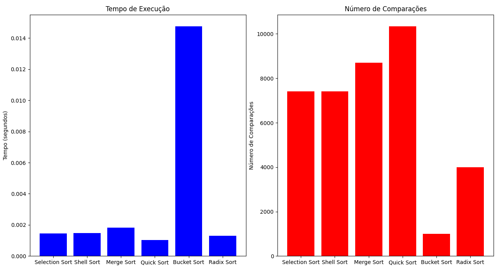
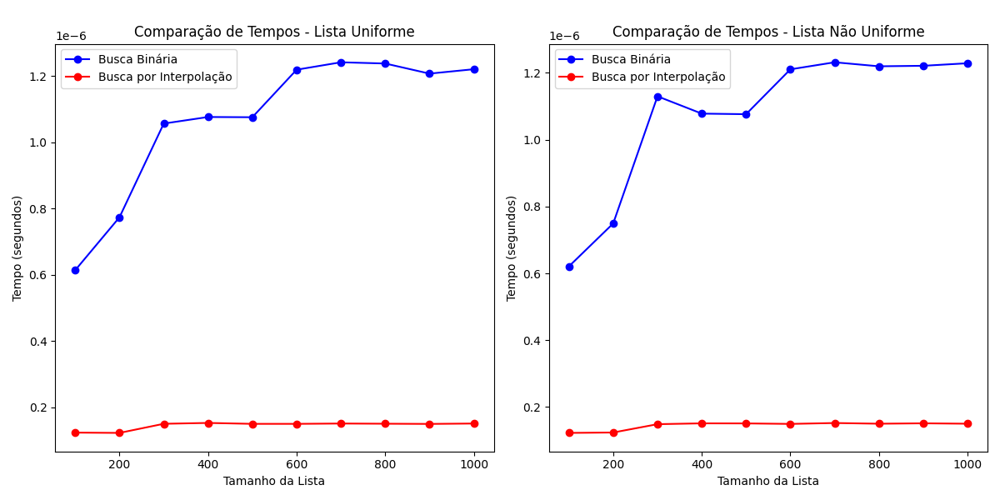

# Algoritmos de Busca e Ordenação

## 1. Busca Binária (Binary Search)
**Descrição**: A **Busca Binária** é um algoritmo de busca eficiente utilizado em listas ordenadas. O algoritmo divide a lista ao meio a cada iteração, comparando o valor central com o elemento alvo. Dependendo do resultado, a busca continua na metade superior ou inferior da lista. A complexidade do algoritmo é O(log n).

**Requisitos**: A lista deve estar ordenada porque o algoritmo depende da comparação do valor central para decidir se a busca deve continuar à esquerda ou à direita. Se a lista não for ordenada, o algoritmo falhará.

**Exemplo**: Se você estiver procurando o número 7 em uma lista ordenada `[1, 3, 5, 7, 9]`, o algoritmo começará verificando o número no meio da lista (5), depois ajusta a busca para a metade superior (onde 7 está localizado).

## 2. Busca por Interpolação (Interpolation Search)
**Descrição**: A **Busca por Interpolação** é uma melhoria da Busca Binária, mas só funciona de maneira eficiente quando a lista está ordenada e os elementos são distribuídos de maneira relativamente uniforme. Em vez de dividir a lista ao meio, ela usa a fórmula de interpolação para estimar a posição do elemento alvo. A complexidade do algoritmo pode ser O(log log n) em casos ideais, mas no pior caso, pode ser O(n).

**Vantagens**: Em listas com distribuição uniforme, a Busca por Interpolação pode ser mais rápida que a Busca Binária. Caso contrário, se os elementos não estiverem uniformemente distribuídos, o desempenho da Busca por Interpolação pode ser pior.

**Exemplo**: Para uma lista de inteiros entre 1 e 100 e uma busca pelo número 47, o algoritmo tenta estimar a posição do 47 com base no valor mínimo e máximo da lista, em vez de ir diretamente ao meio.

## 3. Busca por Saltos (Jump Search)
**Descrição**: A **Busca por Saltos** divide a lista em blocos de tamanho fixo e, a partir da primeira posição, realiza uma busca linear para encontrar o bloco que contém o valor desejado. Em seguida, realiza uma busca linear dentro do bloco. O tempo de execução é O(√n), onde n é o número de elementos na lista.

**Escolha do "salto"**: O tamanho ideal do salto é √n, onde n é o tamanho da lista. Isso garante que o número de saltos seja mínimo e a busca linear dentro do bloco seja eficiente.

**Exemplo**: Se a lista tiver 100 elementos e o "salto" for 10, o algoritmo vai verificar o elemento nas posições 0, 10, 20, e assim por diante, até encontrar o bloco correto.

## 4. Busca Exponencial (Exponential Search)
**Descrição**: A **Busca Exponencial** começa verificando a posição 1, depois 2, 4, 8, 16, etc., dobrando o índice a cada passo até ultrapassar o valor procurado ou chegar ao final da lista. Após isso, o algoritmo realiza uma busca binária entre o último índice válido e o anterior. A complexidade é O(log n).

**Combinação com Busca por Saltos e Busca Binária**: A Busca Exponencial combina a "expansão" de índices (como no Jump Search) com a busca binária para localizar a posição exata do elemento.

**Exemplo**: Se você estiver procurando o número 67 em uma lista crescente, o algoritmo começa verificando os índices 1, 2, 4, 8, até encontrar um índice maior que 67, e depois aplica a Busca Binária entre os índices onde o número poderia estar.

## 5. Shell Sort
**Descrição**: O **Shell Sort** é uma generalização do Insertion Sort. Ele ordena a lista por "intervalos" que diminuem progressivamente até que a lista esteja ordenada. A eficiência do algoritmo depende da sequência de intervalos utilizada. As versões mais comuns das sequências de intervalo são: Shell, Knuth e Hibbard.

**Escolha da sequência de intervalo**: A sequência de intervalo afeta a eficiência do algoritmo. Sequências mais eficientes reduzem a quantidade de comparações necessárias. O algoritmo é mais eficiente que o Insertion Sort para listas grandes.

**Exemplo**: Para uma lista de tamanho 10, a sequência de intervalos pode começar com 5, depois 3, e, finalmente, 1.

## 6. Merge Sort
**Descrição**: O **Merge Sort** é um algoritmo de ordenação baseado no princípio de "dividir para conquistar". Ele divide a lista em duas metades, ordena cada metade recursivamente e depois as combina (merge). A complexidade do Merge Sort é O(n log n), o que o torna eficiente para listas grandes.

**Dividir para conquistar**: A lista é dividida em sublistas cada vez menores até que cada sublista tenha um único elemento. Em seguida, as sublistas são combinadas de forma ordenada.

**Exemplo**: Para ordenar `[38, 27, 43, 3, 9, 82, 10]`, o Merge Sort divide a lista em duas metades, ordena cada metade recursivamente e depois as mescla para formar a lista ordenada.

## 7. Selection Sort
**Descrição**: O **Selection Sort** é um algoritmo simples que encontra o menor (ou maior) elemento em uma lista e o coloca na posição correta. Esse processo é repetido até que a lista esteja ordenada. Sua complexidade é O(n²), tornando-o ineficiente para listas grandes.

**Exemplo**: Para ordenar `[29, 10, 14, 37, 13]`, o Selection Sort seleciona o menor valor (10), troca-o com o primeiro elemento, e continua o processo com o restante da lista.

## 8. Bucket Sort
**Descrição**: O **Bucket Sort** divide os elementos em intervalos chamados de "baldes". Cada balde é ordenado separadamente, e os resultados são combinados. O algoritmo é mais eficiente para listas com valores distribuídos uniformemente em um intervalo fixo. A complexidade média é O(n + k), onde n é o número de elementos e k é o número de baldes.

**Exemplo**: Para ordenar a lista `[0.42, 0.32, 0.63, 0.53, 0.51]`, o Bucket Sort distribui os elementos nos baldes e, em seguida, ordena cada balde individualmente antes de combinar os resultados.

## 9. Radix Sort
**Descrição**: O **Radix Sort** é um algoritmo não comparativo de ordenação que ordena os números por cada dígito, começando pelo dígito menos significativo até o mais significativo. Ele pode ser aplicado em qualquer base (como base 10 ou base 2) e tem complexidade O(nk), onde n é o número de elementos e k é o número de dígitos.

**Exemplo**: Para ordenar a lista `[170, 45, 75, 90, 802, 24, 2, 66]`, o algoritmo começa classificando os números com base no primeiro dígito, depois no segundo, e assim por diante.

## 10. Quick Sort
**Descrição**: O **Quick Sort** é um algoritmo eficiente de ordenação baseado na estratégia "dividir para conquistar". Ele escolhe um pivô, particiona a lista em torno desse pivô e recursivamente ordena as sublistas. A complexidade média é O(n log n), mas no pior caso pode ser O(n²).

**Escolha do pivô**: O desempenho do Quick Sort depende da escolha do pivô. Se o pivô for escolhido de maneira eficiente (como o pivô médio ou o pivô aleatório), o algoritmo pode ter bom desempenho mesmo em listas grandes.

## 11. Ternary Search
**Descrição**: O **Ternary Search** é uma variação do Binary Search, onde a lista é dividida em três partes ao invés de duas. O algoritmo compara o elemento com os dois pontos de divisão e decide em qual terço a busca continuará. Ele tem complexidade O(log₃ n), que é ligeiramente melhor que o Binary Search em algumas situações.

**Exemplo**: Em uma lista ordenada, ao invés de comparar com o elemento do meio, o Ternary Search divide a lista em três partes e faz duas comparações em cada iteração.

## 12. Comparação dos Algoritmos de Busca

## 13. Comparação dos Algoritmos de Ordenação

## 14. Busca Binária vs Busca por Interpolação

